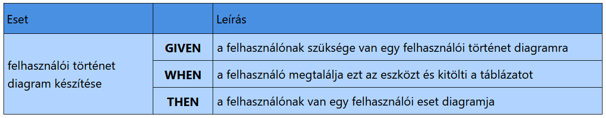

Ez az eszköz segít a **felhasználói történetek (user story-k) készítésében**. Az eszköz az ELTE-IK Objektumelvű Programozás tárgyára készült, illetve bármely más tárgyhoz ahol szükség van rá.

---

## Felhasználói történet (User Story) szerkezete

Minden user story a következő elemekből áll:

- **Tevékenység neve (Eset)** – a művelet rövid megnevezése.  
- **Előfeltétel (GIVEN)** – milyen feltételek meglétét feltételezi a tevékenység.  
- **Esemény (WHEN)** – mi a kiváltó esemény, ami elindítja a tevékenységet.  
- **Eredmény (THEN)** – mi a hatása a tevékenység végrehajtásának, milyen eredményt ad.
---

## Példa

---

## Használat

1. Nyisd meg az alkalmazást a következő linken: [User Story Creator](https://dragondominik.github.io/user-story-creator/)
2. Adj hozzá tetszőleges számú táblázatot és azokhoz tetszőleges számű esetet.
3. Ha kész vagy JSON fileként tudod exportálni az összes táblát egyszerre későbbi szerkeztésre, illetve át tudod egyesével helyezni akár Microsoft Wordbe is a táblákat.

---

## Techstack

- HTML5
- TailwindCSS
- Javascript